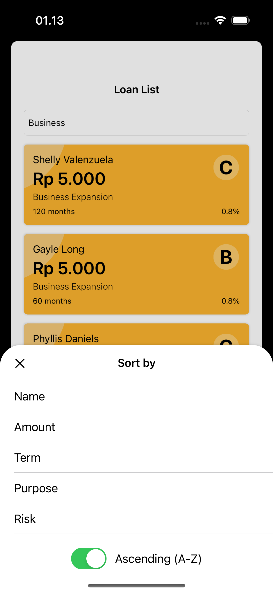

# Loliloan

Loliloan is a simple application for managing loan data. The app allows users to search, sort, and filter loans based on various criteria such as borrower's name, loan amount, and loan purpose. Additionally, users can view details of each loan and zoom in on related documents.

## Technologies Used

- **Xcode**: Version 15.2
- **Swift**: Version 5
- **UIKit**
- **RxSwift**
- **MVVM Design Pattern**

## Features

- View list of loan with user friendly view.
- View details of each loan, including borrower information and loan details
- View documents related to the loan

## How to Run

To run this project, follow these steps:

1. Clone this repository.

2. Open the project in Xcode.

3. Install any dependencies required by the project using CocoaPods `pod install`.

4. Build and run the project using the "Run" button in Xcode or by pressing Command + R.

## Approach

This project is built using Swift programming language and follows the Model-View-ViewModel (MVVM) architecture pattern. The user interface is implemented using UIKit framework. RxSwift is used for reactive programming, enabling seamless handling of asynchronous events and data streams.

The MVVM architecture separates the presentation logic from the business logic and data handling. ViewControllers represent the View layer, ViewModels encapsulate the presentation logic, and Models handle the data layer. RxSwift facilitates the communication between ViewControllers and ViewModels through observable data streams.

## Decisions

1. **MVVM Architecture**: I chose MVVM architecture for its clarity, maintainability, and testability. By separating concerns into distinct layers, I ensure a clean and scalable codebase.

2. **RxSwift Integration**: I integrated RxSwift to leverage its powerful reactive programming capabilities. This allows me to handle asynchronous events, data binding, and UI updates in a declarative and concise manner.

## Additional Features

1. **Search Functionality**: Implemented search functionality to allow users to search for loans based on borrower's name, loan amount, term, loan purpose, or risk.
2. **Sorting**: Added sorting functionality to sort loans by borrower's name, loan amount, term, loan purpose, or risk.
3. **Filtering**: Implemented filtering options to filter loans based on specific criteria such as purpose, term, or risk rating.
5. **Document Zoom**: Enabled zoom functionality for viewing documents related to loans, enhancing user experience and readability.

## Screenshot

      
